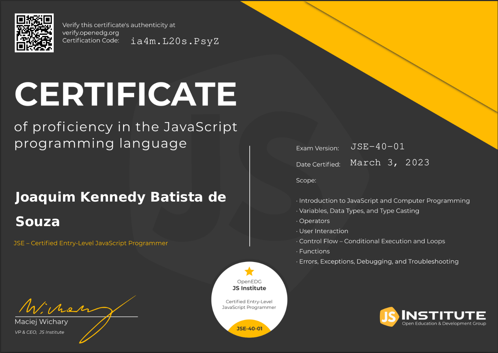

<main>
<h1>👋 Olá a todos, eu sou Kennedy!</h1>

  
  
  
  
  
  
  
  
  
  
  

 

  

    
Sou um engenheiro de software full stack com foco no back end. Tenho uma ampla experiência trabalhando com várias tecnologias, incluindo Python, PHP, Node.js e Java. Atualmente, estou direcionando meus esforços para me especializar ainda mais em Java, enquanto também estou explorando Go Lang.

    
💻 Com uma sólida base em desenvolvimento full stack, concentro-me principalmente no desenvolvimento do lado do servidor e na criação de sistemas robustos e escaláveis. Ao longo da minha carreira, tive a oportunidade de trabalhar em diversos projetos desafiadores, aplicando minha experiência em diferentes linguagens e tecnologias.

    
🔭 Estou sempre buscando expandir meu conhecimento e habilidades técnicas, e aprofundar minha compreensão de Java e Go Lang é um dos meus principais objetivos no momento. Estou animado para explorar as possibilidades oferecidas por essas linguagens e aplicá-las em projetos futuros.

    
📫 Se você está procurando colaboradores para projetos empolgantes ou quer discutir sobre tecnologia, estou sempre aberto a novas oportunidades de aprendizado e colaboração. Você pode entrar em contato comigo pelo <a href="https://www.linkedin.com/in/joaquim-kennedy-1001b3197/">LinkedIn</a> para trocar experiências ou compartilhar ideias sobre o desenvolvimento de software.

  

  

    
    
  

<section style="display:flex; justify-content:center; gap:20px; height:15rem; width:100%">
  
  
</section>
</main>
